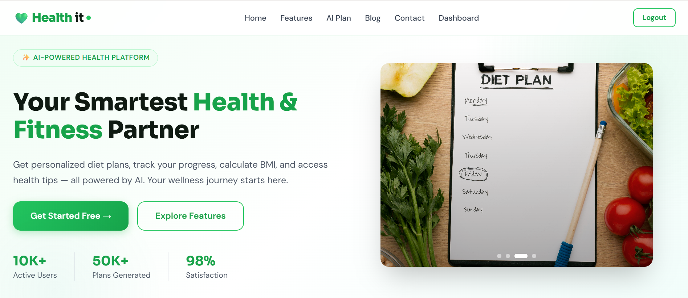
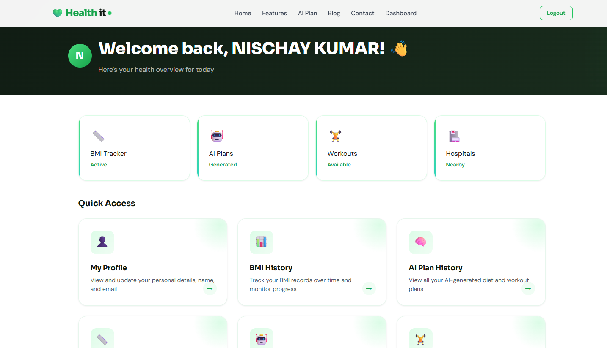
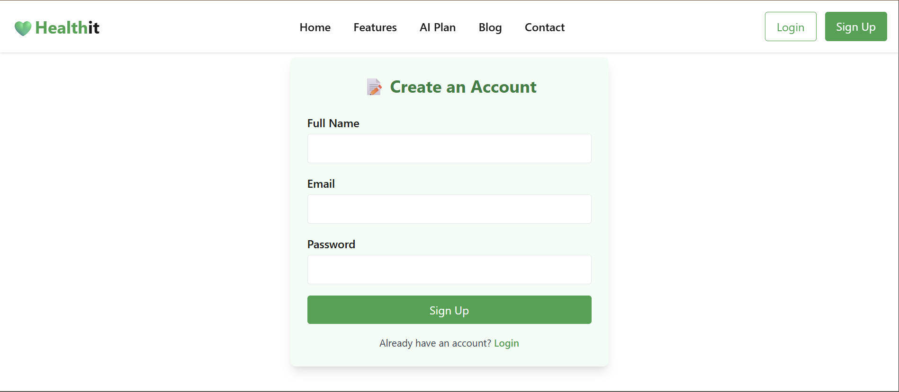
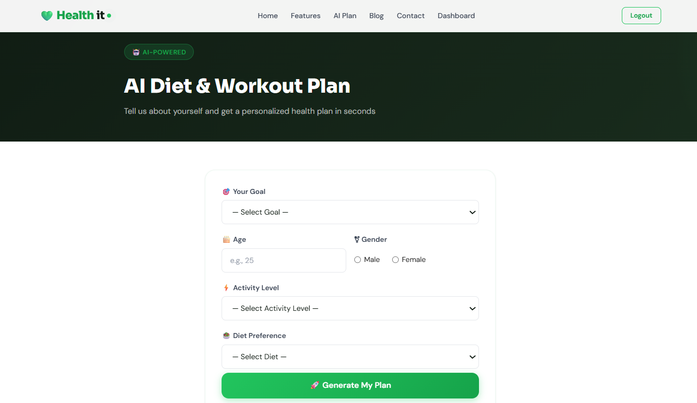
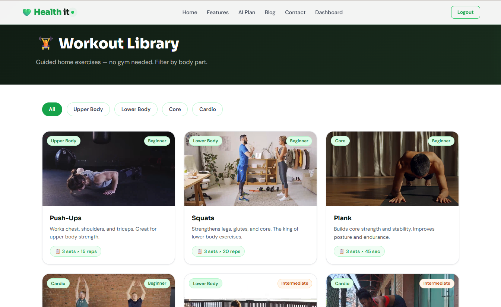

# Healthit – Fitness & Health Web Application

Healthit is a full-stack fitness and health management web application
built using the MERN stack. The project focuses on BMI tracking,
AI-powered diet and workout planning, and secure user authentication.
It is designed to simulate a real-world production-style application.

---

## 📸 Screenshots

### Home Page

### Features Page

### Dashboard

### Signup Page

### AI Diet & Workout Plan

### Workouts Section

---

## 🚀 Features

- User authentication (Login / Signup)
- BMI calculator with BMI history tracking
- AI-based personalized diet & workout plans  
  (Using **DeepSeek API via OpenRouter**)
- Role-based access control (User / Admin)
- Admin panel for blog management
- Responsive UI (Desktop & Mobile)
- Secure REST APIs

---

## 🛠️ Tech Stack

### Frontend
- HTML
- CSS
- Tailwind CSS
- JavaScript

### Backend
- Node.js
- Express.js

### Database
- MongoDB

### Tools & Deployment
- Git & GitHub
- Render
- MongoDB Atlas

---

## ⚙️ How This Project Works

1. Users register and log in using secure authentication
2. After login, users can calculate BMI and store BMI history
3. The AI module generates personalized diet and workout plans
4. Admin users can create, update, and delete health blogs
5. All application data is securely stored in MongoDB

---

## 📂 Project Structure

/controllers
/routes
/models
/views
/public
server.js

---

## 📚 What I Learned

- Building REST APIs using Node.js and Express
- Implementing authentication and role-based authorization
- Designing MongoDB schemas and handling data securely
- Structuring a scalable full-stack application
- Debugging and deploying applications on cloud platforms
- Integrating AI APIs into real-world projects
